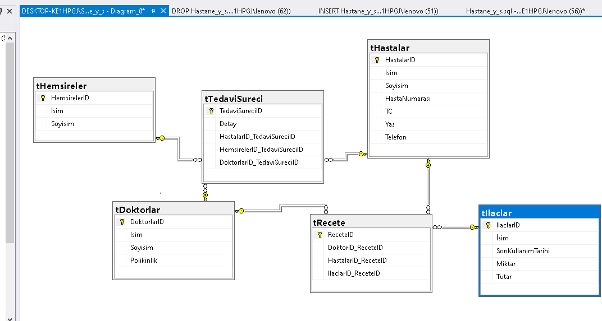

# Hastane Yönetim Sistemi Veri Tabanı
Bu proje, MS SQL Server kullanılarak geliştirilmiş, ilişkisel veri tabanı tasarımı içeren bir sistemdir. Tablolar arası ilişkiler ve veri bütünlüğü (Foreign Key, Constraints) profesyonelce kurgulanmıştır.

### Proje İçeriği
* **Hastane_Sistemi_Kodlari.sql:** Projenin tüm SQL kaynak kodları bu dosyadadır.
* **Diyagram:** Aşağıda veri tabanı şeması yer almaktadır.

---

### Veri Tabanı Şeması (ER Diyagramı)

